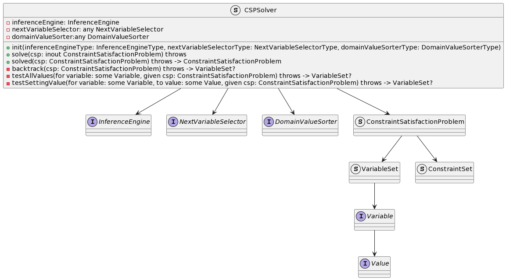
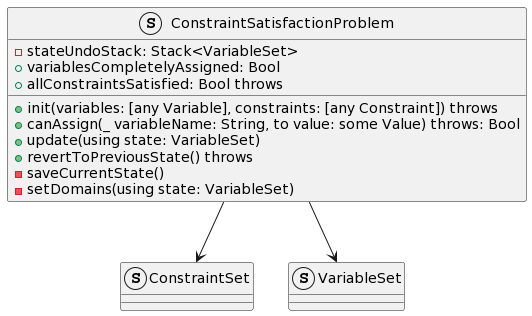
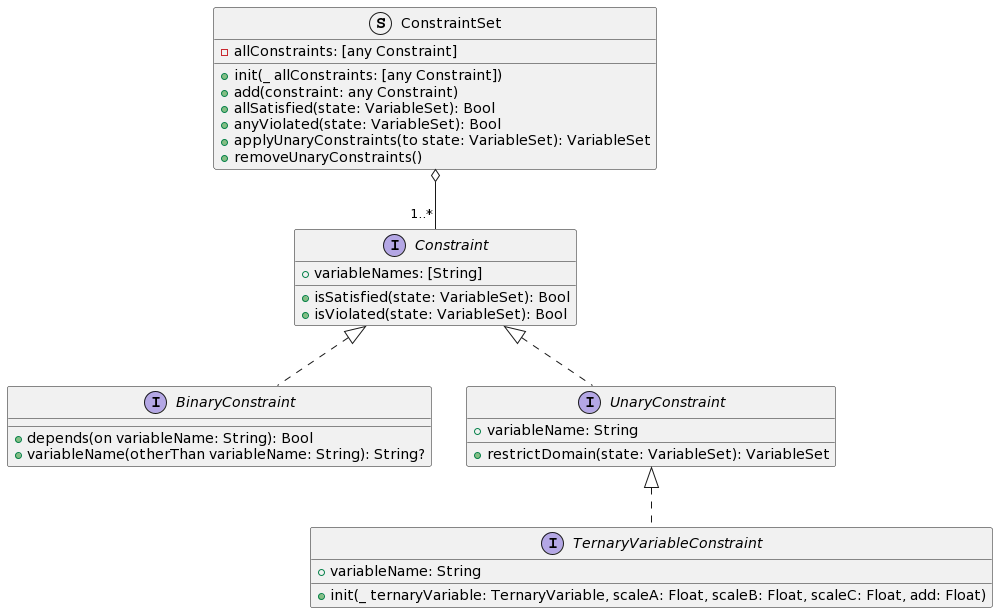
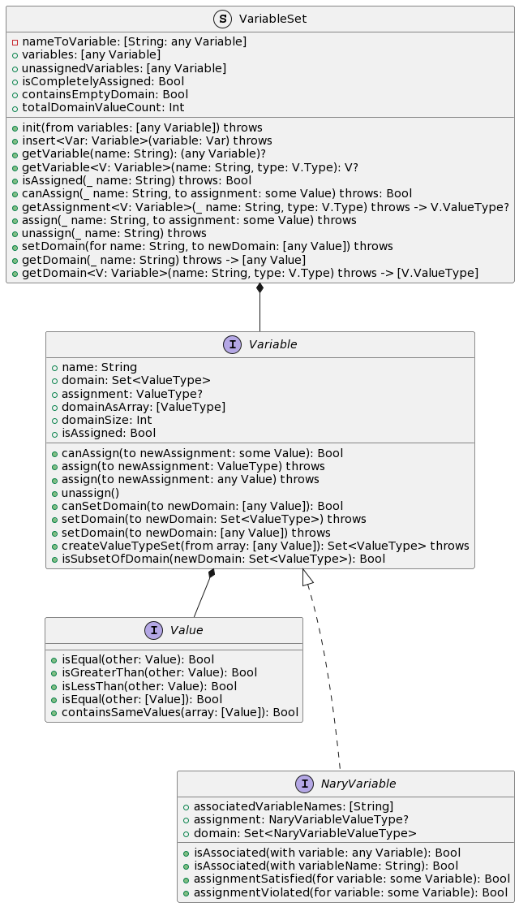
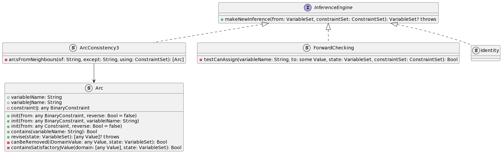

# CSPSwift

A Constraint Satisfaction Problem (CSP) solver package written in Swift. 

This project came about when my friend and I decided to create a solver for [Aquarium](https://www.puzzle-aquarium.com), an online puzzle game. See his repo [here](https://github.com/nguyenvukhang/aquarium)!

We initially came up with a naive backtracking solution, but since I had recently completed a Software Engineering course in school, I decided that it would be good practice to create a flexible, general CSP solver, while attempting to employ good Software Engineering practices.

I am still in the process of integrating this package into our Aquarium solver. Once it is done I will leave a link to it here for you to check out this package in action.

## Software Architecture

### CSPSolver



`CSPSolver` is essentially a backtracking solver that 

1. selects a variable, 
2. assigns it a value and 
3. makes inferences, then repeats.

The `CSPSolver` can be customized for different use cases, with 3 areas of customization:

1. `NextVariableSelector`: implements a heuristic to select the next variable to assign.
2. `DomainValueSorter`: implements a heuristic to sort the domain values of the selected heuristic.
3. `InferenceEngine`: implements some form of consistency checking, ensuring other variables' domains only contain assignable values.

### ConstraintSatisfactionProblem



The `ConstraintSatisfactionProblem` struct contains all the information about the CSP. It contains a `ConstraintSet` and a `VariableSet` (we will look into both in further detail in later sections).

The most notable features are:

1. `update(using state: VariableSet)`: Given a `VariableSet`, updates the CSP's representation to hold the new information provided. Updates usually happen when `Variable`s are assigned or their domains are changed.

2. `revertToPreviousState()`: `ConstraintSatisfactionProblem` keeps track of a `Stack` of previous `VariableSet`s (basically an undo stack), this method allows us to undo the CSP to its previous state. This is useful for backtracking.

### Constraints



A `Constraint` is basically used as a predicate. Its methods `isSatisfied` and `isViolated` take in a state in the form of a `VariableSet` and perform the necessary checks.

Only `BinaryConstraints` and `UnaryConstraints` have been implemented since any N-ary constraint can be converted into a combination of _Ternary Constraints_ and some respective auxillary constraints. _Ternary Constraints_ are currently implemented by having a `TernaryVariable` with a `UnaryConstraint` applied to it (see [Hidden Variable Encoding](https://www.cs.cmu.edu/afs/cs/project/jair/pub/volume24/samaras05a-html/node8.html)). (A point of improvement could be to create `TernaryConstraint` which automatically creates the necessary `TernaryVariable` and auxillary constraints.) 

A `ConstraintSet` simply acts as a collection of all constraints in the CSP. The `Set` data structure should be used here, but Swift does not allow heterogenous `Set`s, where all elements conform to the same protocol, so an `Array` is used instead, and the `any` keyword is used to erase the runtime type of the element, so that it can be inserted into the `Array`. This might be a good argument to use classes instead of structs here since `Set`s should be able to hold all objects that inherit from some hypothetical `Constraint` superclass.

### Variables



Firstly, `Value` is simply a Protocol for the user to conform to when creating their own value types. 

`Variable` is a Protocol for all type of variables in the CSP, like `IntVariable`, `FloatVariable` etc., and it ensures that all `Variables` provide the necessary getters, setters and queries. Each `Variable` has an associated type `ValueType`, which is the type of the `Value` that the `Variable` stores.

`VariableSet`, like `ConstraintSet` is simply a collection of `Variable`s. For the same reason, an Array is used to hold the `Variable`s. Because the runtime type of each element in the `VariableSet` is erased, some appropriate methods are overloaded to provide a way for the caller to add in the type of the expected `Variable`, so that the return type can already be casted to the correct `ValueType`.

For example,
```
getAssignment("myIntVariable", type: IntVariable.self)
```
returns a value of type `Int` since that is the `ValueType` associated with `IntVariable`.

### NextVariableSelector

Currently, the only concrete implementation is the **Minimum Remaining Values (MRV)** heuristic. 

Since every variable needs an assignment in a CSP, this heuristic aims to fail first, selecting the variable with the smallest remaining domain to be assigned next. 

1. If the variable has **no values in its domain**, the search has failed and there is no need to continue searching. 
2. If **not**, selecting the variable with the smallest remaining domain will ensure that each search tree will be the largest it can be, hence if we reach a failure in the next iteration, the size of the pruned tree is maximized.

### DomainValueSorter

There are currently 2 concrete implementations, 

1. the Least Constraining Value (LCV) heuristic and
2. Random.

The LCV heuristic aims to sort the domain values in a way that fails last, since we only need one out of all the possible valid solutions. For each domain value, we suppose the variable is set to that domain value, then the total number of valid domain values in the entire CSP is counted. Finally, the domain values are sorted in descending order of the count.

However, experiments show that this heuristic is too slow in practice, likely due to the step where the total number of valid domain values is counted. Hence, the random Domain Value Sorter was implemented and surprisingly, its average speed is significantly faster, albeit with a larger variance, as expected of randomized algorithms.

### InferenceEngine



The purpose of the `InferenceEngine` is to handle consistency checking, removing values from the domain of a `Variable` once we are sure that they should no longer be considered.

There are 3 concrete implementations of `InferenceEngine` that can be selected:

1. `Identity`: makes no changes to variable domains.
2. `ForwardChecking`: for every domain value in each variable, if it cannot be assigned, removes it.
3. `ArcConsistency3`: the AC-3 algorithm developed by Alan Mackworth.

In order to allow convenient construction of each type of `InferenceEngine`, a factory was created, taking in an enum value for the type to create.